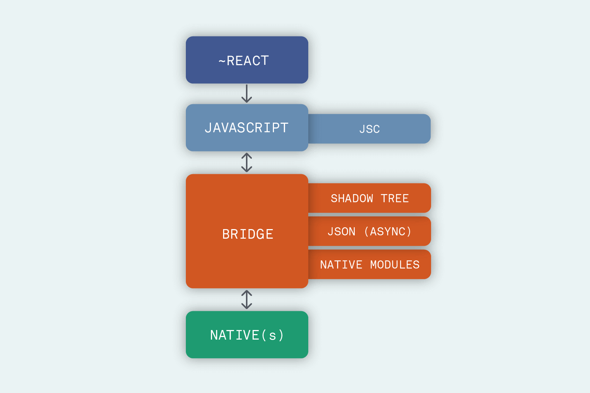
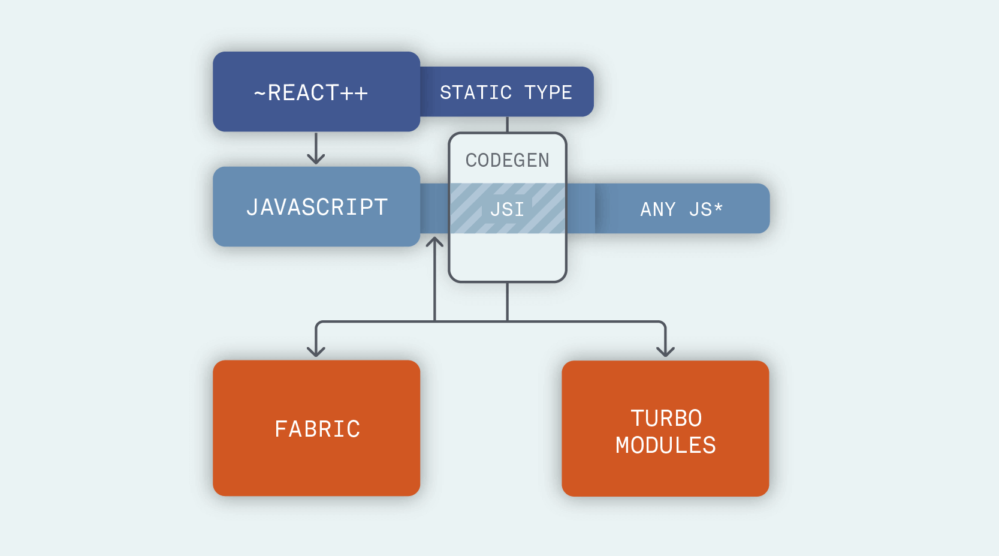

# RN架构变革

## 旧架构

### Bridge

JS + Bridge + Native， 通过 Bridge 在JS和Native之间传递信息。

Bridge 层是 React Native 技术的关键，设计上具有 3 个特点：

- 异步（asynchronous）：不依赖于同步通信

- 可序列化（serializable）：保证一切 UI 操作都能序列化成 JSON 并转换回来

- 批处理（batched）：对 Native 调用进行排队，批量处理

### 线程模型

 React Native 中主要有 3 个线程，分别是：

- UI Thread：Android/iOS（或其它平台）应用中的主线程

- Shadow Thread：进行布局计算和构造 UI 界面的线程

- JS Thread：React 等 JavaScript 代码都在这个线程执行

### 启动过程

1. 加载 JavaScript 代码：开发模式下从网络下载，生产环境从设备存储中读取

2. 初始化 Native Modules：根据 Native Module 注册信息，加载并实例化所有 Native Module

3. 注入 Native Module 信息：取 Native Module 注册信息，作为全局变量注入到 JS Context 中

4. 初始化 JavaScript 引擎：即 JavaScriptCore

:::tip

RN旧架构缺陷与不足：

异步：无法将 JavaScript 逻辑直接与许多需要同步的 Native API 集成

批处理：很难让 React Native 应用调用 Native 实现的函数

可序列化：存在不必要的 copy，而不是直接共享内存

这些问题在RN原生混合APP中尤为突出。
:::

## 新架构

### 架构改动

JavaScript 层： 保证类型安全（使用CodeGen 工具 与 类型约束， 保证 JavaScript 与 Native 通信中的类型安全）

JavaScript 层：引入 JSI，允许替换不同的 JavaScript 引擎

Bridge 层：划分成 Fabric 和 TurboModules 两部分，分别负责 UI 渲染与 Native 模块

Native 层：精简核心模块，将非核心部分拆分出去作为社区模块独立更新维护。

### Fabric 渲染器

- Fabric 使用 JSI 在 C++层与JavaScript层通信。

JSI 作用：屏蔽JS引擎差异（如替换JS引擎），可以持有 C++对象的引用。

:::tip
C++对象拥有 Native 的天然支持：

Android：通过 JNI（Java Native Interface）调用 C 或 C++模块

iOS：Objective-C 默认支持
:::

- Fabric实现了同步和线程安全的布局计算，提升了用户体验。

### TurboModules

之前所有 Native Modules（无论是否需要用到）都要在**应用启动时进行初始化**，因为 Native 不知道 JavaScript 将会调用哪些功能模块。而新的TurboModules 允许**按需加载 Native 模块**，并在模块初始化之后直接持有其引用，不再依靠消息通信来调用模块功能。因此，应用的启动时间也会有所提升。
